## JVM体系结构

JVM位置

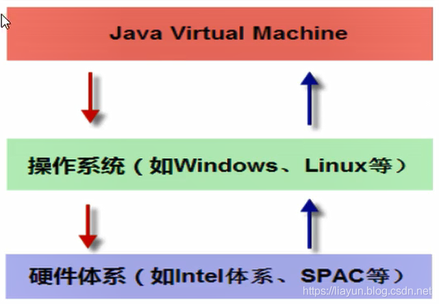

JVM是运行在操作系统之上的，它与硬件没有直接的交互。


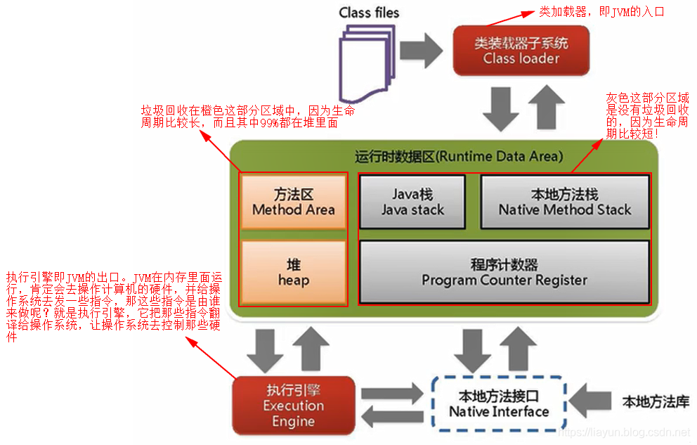

## Java中的常量池

分为三类

- 类文件中常量池（The Constant Pool）
  - 所处区域：堆
  - 诞生时间：编译时
  - 内容概要：
    - 包含字面量和符号引用
    - 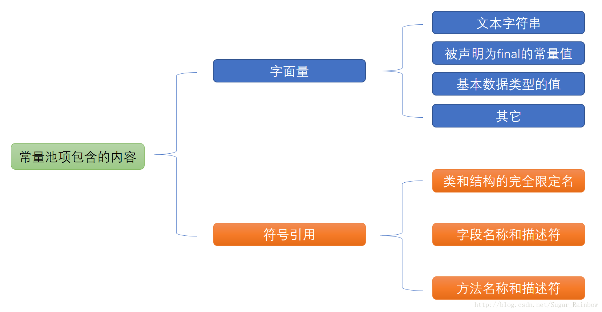
  - class常量池是在编译的时候每个class都有的，在编译阶段，存放的是常量的符号引用。
- 运行时常量池（The Run-Time Constant Pool）
  - 所处区域：元空间
  - 诞生时间：JVM运行时
  - 内容概要：
    - class文件元信息描述，编译后的代码数据，引用类型数据，类文件常量池。 
    -  所谓的运行时常量池其实就是将编译后的类信息放入运行时的一个区域中，用来动态获取类信息。
    - 运行时常量池是在类加载完成之后，将每个class常量池中的符号引用值转存到运行时常量池中，也就是说，每个class都有一个运行时常量池，类在解析之后，将符号引用替换成直接引用，与全局常量池中的引用值保持一致。
- String常量池
  - 所处区域：堆
  - 内容概要：
    - 准备阶段之后在堆中生成字符串对象实例，然后将该字符串对象实例的引用值存到字符串常量池中
    - String常量池中存的是引用值而不是具体的实例对象，具体的实例对象是在堆中开辟的一块空间存放的。


**new对象和Class的区别**

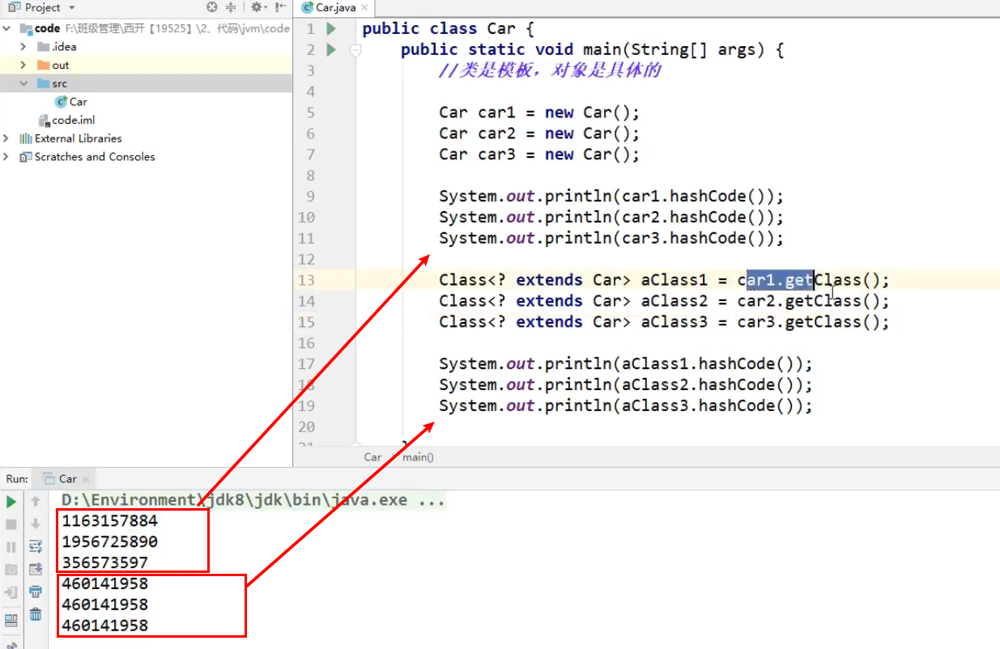

说明

- Class只有一个，无论new多少次；实例有多个，并且地址不一样

**class和对象实例的转换**

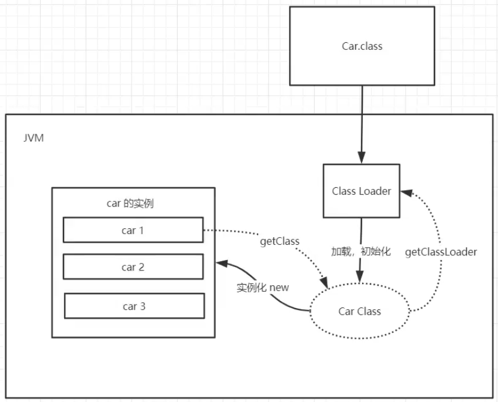

说明

- `Class类`转换为`实例`，是通过`new Class()`
- `实例`转换为`Class`，是通过`实例.getClass()`


类加载机制


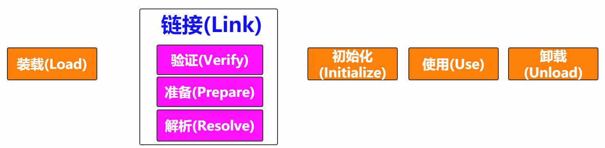

常量池中

- 字面量
  - final修饰 文本  字符串
- 符号引用
  - 类 接口 方法 明细数据 描述


装载

类相关的信息，model信息储存在方法区中

对象，放在堆中

字节码文件变成字节流，然后类加载器寻找到它，

将字节流代表的静态存储结构（静态变量、类信息、常量、即时编译后的代码）转化为方法区的运行时数据结构，

储存在方法区的数据，需要专门的对象对它进行访问，所以java堆中生成一个代表这个类的JAVA.lang.Class对象，作为数据访问入口


链接

验证：验证格式的正确性，符号引用？字节码？保证文件不能有问题

准备：为类的静态变量分配内存 ，赋予默认值

解析：符号引用转换成直接引用，即在虚拟机中开辟一块地址，真正指向一块地址


初始化

给静态变量复制，初始化静态代码块，初始化当前类，当前类的parent


## 类加载器

- 虚拟机自带的加载器
- 启动类（根）加载器Bootstrap classLoader
  - 主要负责加载核心的类库(java.lang.*等)，构造ExtClassLoader和APPClassLoader
- 扩展类加载器 ExtClassLoader
  - 主要负责加载jre/lib/ext目录下的一些扩展的jar。
- 应用程序加载器 AppClassLoader
  - 主要负责加载应用程序的主函数类

加载顺序是自下往上找

```java
public class Car {
    public static void main(String[] args) {
        Car car = new Car();
        Class<? extends Car> aClass = car.getClass();
        ClassLoader classLoader = aClass.getClassLoader();
        System.out.println("classLoader: "+classLoader); //sun.misc.Launcher$AppClassLoader@18b4aac2
        System.out.println("classLoader.getParent(): "+classLoader.getParent());//sun.misc.Launcher$ExtClassLoader@4554617c  在jre/lib/ext拓展包下面
        System.out.println("classLoader.getParent().getParent(): "+classLoader.getParent().getParent());//null  1.不存在 2.java程序获取不到  在lib/rt.jar
    }
}
```


## 双亲委派机制

**工作原理**

- 1.如果一个类加载器收到了类加载请求，它并不会自己先去加载，而是把这个请求委托给父类的加载器去执行

- 2.如果父类加载器还存在其父类加载器，则进一步向上委托，依次递归，请求最终将到达顶层的启动类加载器

- 3.如果父类加载器可以完成类加载任务，就返回成功，倘若父类加载器无法完成此加载任务，子加载器才会尝试自己去加载，这就是双亲委派模式

  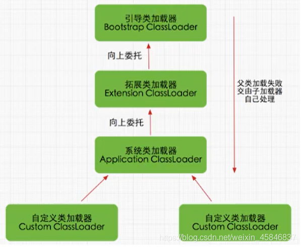

**优点**：

- 避免类的重复加载
- **保护程序安全，防止核心API被随意篡改**

举例：

，如图，我们自定义包路径为java.lang，并在此包下定义一个String类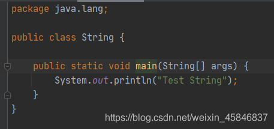，在String类中启动main方法，ide会报错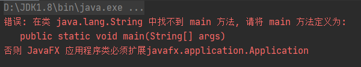，找不到main方法。

**原因**在于String类是java的核心类，位于java.lang包下，当我们启动main方法时，需要先获取main方法所在的类，也就是String类，经过层层向上委托直到引导类加载器，引导类加载器发现该类是java.lang包下的，所以该类由引导类加载器加载，但原生String类并没有main方法，故报错“找不到main方法”


## 沙箱安全机制

**概念**：

​		Java安全模型的核心就是Java沙箱（sandbox），什么是沙箱？沙箱是一个限制程序运行的环境。

沙箱机制就是将 Java 代码限定在虚拟机(JVM)特定的运行范围中，并且严格限制代码对本地系统资源访问，通过这样的措施来==保证对代码的有效隔离==，==防止对本地系统造成破坏==。

沙箱==主要限制系统资源访问==，那系统资源包括什么？——`CPU、内存、文件系统、网络`。

**java安全模型**：
		当前最新的安全机制实现，则引入了`域 (Domain)` 的概念。

​		虚拟机会把所有代码加载到不同的系统域和应用域，`系统域部分`专门负责与关键资源进行交互，而`各个应用域部分`则通过系统域的部分代理来对各种需要的资源进行访问。

​		虚拟机中不同的`受保护域 (Protected Domain)`，对应不一样的权限 (Permission)。存在于不同域中的类文件就具有了当前域的全部权限，如下图所示 最新的安全模型(jdk 1.6)

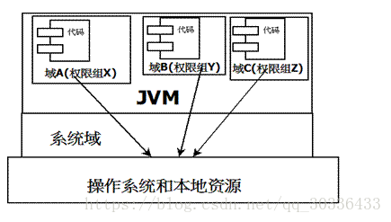

**组成沙箱的基本组件**：

`字节码校验器（bytecode verifier）`：确保Java类文件遵循Java语言规范。这样可以帮助Java程序实现内存保护。但并不是所有的类文件都会经过字节码校验，比如核心类。

`类装载器（class loader）`：其中类装载器在3个方面对Java沙箱起作用：

- 它防止恶意代码去干涉善意的代码

- 它守护了被信任的类库边界

- 它将代码归入保护域，确定了代码可以进行哪些操作

## native

凡是带了native的关键字，说明是java作用范围不到的，去调用底层C语言的库

JNI ：Java Native Interface （Java本地方法接口）

凡是带了native关键字的方法，就会进入本地方法栈，其他的就是java栈；


## PC寄存器

程序计数器：Program Counter Register

每个线程都有一个程序计数器，是线程私有的，就是一个指针，指向方法区中的方法字节码（用来存储指向像一条指令的地址，也即将要执行的指令代码），在执行引擎读取下一条指令，是一个非常小的内存空间，几乎可以忽略不计。


## 方法区

Method Area方法区
方法区是被所有线程共享，所有字段和方法字节码，以及一些特殊方法，如构造函数，接口代码也在此定义，简单说，所有定义的方法的信息都保存在该区域，此区域属于共享区间；

==**静态变量**、**常量**、**类信息（构造方法、接口定义）**、运行时的**常量池**存在方法区中，但是实例变量存在堆内存中，和方法区无关==


## 栈

**概念和位置**

java虚拟机栈是线程私有的，生命周期与线程相同。

线程结束，栈内存也就释放，==栈不存在垃圾回收问题==

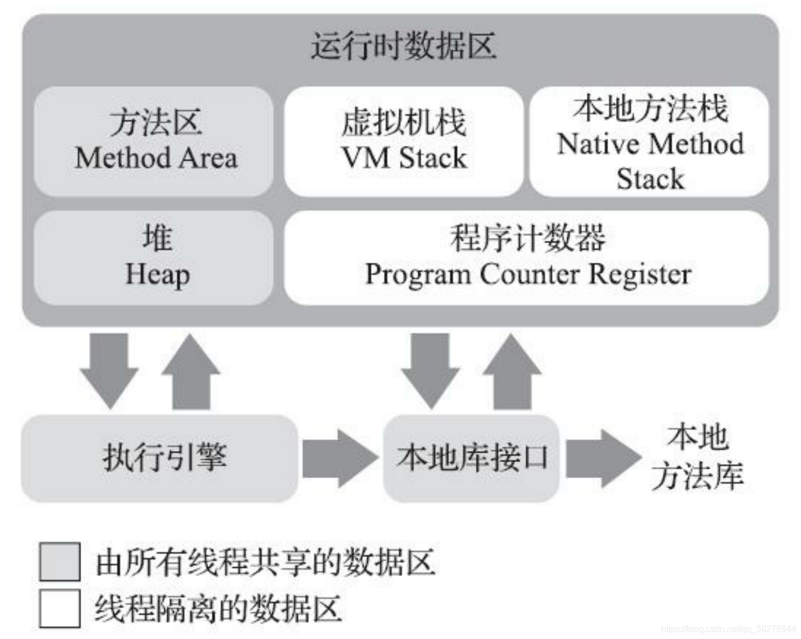

**栈的结构**：

每个线程都有自己的栈，栈中的数据都是以栈帧（Stack Frame)格式存在的

在线程上每个方法都对应一个栈帧

诊帧是一个内存区域，是一个数据集，维系这方法执行过程中的各种数据信息

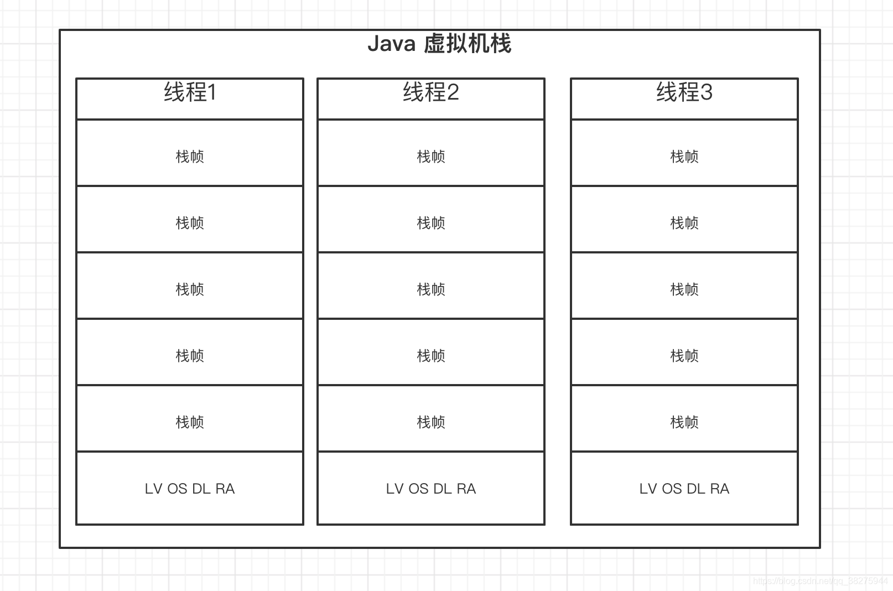


 **栈内放的内容**：

8大基本类型+对象引用+实例的方法


**栈运行原理**：

两个操作+一个栈帧+操作当前栈帧+不相互引用+两种返回函数

- JVM直接对java栈的操作，只有两个，也就是对栈帧的压栈和出栈，遵循FIFO/LIFO原则

- 在一条活动线程中，一个时间点上只有一个活动的栈帧，即只有当前正在执行的方法的栈帧（栈顶栈帧）是有效的，这个栈帧被称作**当前栈帧**，与当前栈帧相对应的方法就是**当前方法**，定义这个方法的类称作**当前类**

- 执行引擎运行的所有字节码指令只针对当前栈帧进行操作
  如果在该方法中调用了其他方法，那么对应的新的栈帧会被创建出来，放在栈顶成为新的当前栈帧。

- 不同线程中所包含的栈帧是不允许存在相互引用的，即不可能在一个栈帧之中引用另外一个线程的栈帧
  如果当前方法调用了其它方法，方法返回的时候，当前栈帧会传回此方法的执行结果给当前一个栈帧，接着虚拟机会丢弃当前栈帧使前一个栈帧重新成为当前栈帧。

- Java方法有两种返回函数的方式，一种是正常的函数返回使用return指令，另外一种则是抛出异常（如StackOverflowError），不管使用那种方式都会导致栈帧被弹出。
  

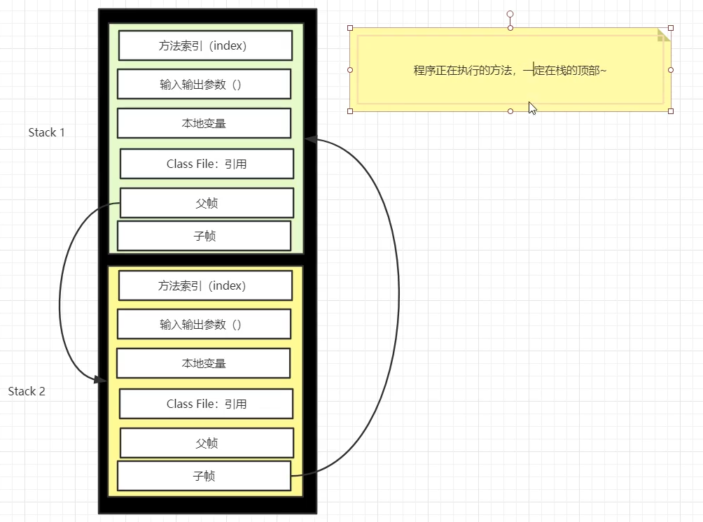


**栈帧的结构**：

- 局部变量表（LV)
- 操作数栈(OS)
- 动态链接（或指向运行时常量池的方法饮用）DL
- 方法返回地址（或方法正常推出或者异常退出的定义）RA
- 一些附加信息

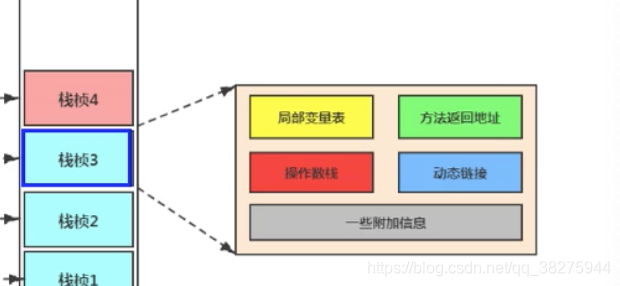


