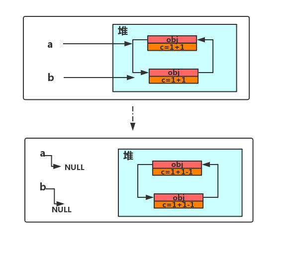

## JVM体系结构

JVM位置


JVM是运行在操作系统之上的，它与硬件没有直接的交互。


说明：

- 元空间：逻辑上存在，物理上不存在


## 常量池

分为三类：类文件中常量池、运行时常量池、String常量池

- 类文件中常量池（The Constant Pool）
  - 所处区域：堆
  - 诞生时间：编译时
  - 内容概要：
    - 包含字面量和符号引用
    - 
  - class常量池是在编译的时候每个class都有的，在编译阶段，存放的是常量的符号引用。
- 运行时常量池（The Run-Time Constant Pool）
  - 所处区域：元空间
  - 诞生时间：JVM运行时
  - 内容概要：
    - class文件元信息描述，编译后的代码数据，引用类型数据，类文件常量池。 
    -  所谓的运行时常量池其实就是将编译后的类信息放入运行时的一个区域中，用来动态获取类信息。
    - 运行时常量池是在类加载完成之后，将每个class常量池中的符号引用值转存到运行时常量池中，也就是说，每个class都有一个运行时常量池，类在解析之后，将符号引用替换成直接引用，与全局常量池中的引用值保持一致。
- String常量池
  - 所处区域：堆
  - 内容概要：
    - 准备阶段之后在堆中生成字符串对象实例，然后将该字符串对象实例的引用值存到字符串常量池中
    - String常量池中存的是引用值而不是具体的实例对象，具体的实例对象是在堆中开辟的一块空间存放的。


**new对象和Class的区别**


说明

- Class只有一个，无论new多少次；实例有多个，并且地址不一样

**class和对象实例的转换**


说明

- `Class类`转换为`实例`，是通过`new Class()`
- `实例`转换为`Class`，是通过`实例.getClass()`


## 类加载的执行过程


- 装载
  - 根据查找路径找到相应的 class 文件然后导入

    - 类相关的信息，model信息储存在方法区中

      对象，放在堆中

      字节码文件变成字节流，然后类加载器寻找到它，

      将字节流代表的静态存储结构（静态变量、类信息、常量、即时编译后的代码）转化为方法区的运行时数据结构，

      储存在方法区的数据，需要专门的对象对它进行访问，所以java堆中生成一个代表这个类的JAVA.lang.Class对象，作为数据访问入口

- 链接
  - 验证：验证格式的正确性，符号引用？字节码？保证文件不能有问题
  - 准备：为类的静态变量分配内存 ，赋予默认值
  - 解析：符号引用转换成直接引用，即在虚拟机中开辟一块地址，真正指向一块地址

- 初始化
  - 对静态变量和静态代码块执行初始化工作。

> 常量池存储内容
>
> ​	有字面量和符号引用
>
> ​	其中**字面量**包括   `final修饰 文本  字符串`
>
> ​			**符号引用**包括 `类 接口 方法 明细数据 描述`


## 类加载器

- 启动类（根）加载器Bootstrap classLoader
  - 主要负责加载核心的类库(java.lang.*等)，构造ExtClassLoader和APPClassLoader
- 扩展类加载器 ExtClassLoader
  - 主要负责加载jre/lib/ext目录下的一些扩展的jar。
- 应用程序加载器 AppClassLoader
  - 主要负责加载应用程序的主函数类，根据 Java 应用的类路径（CLASSPATH）来加载 Java 类
- 用户自定义类加载器
  - 通过继承 java.lang.ClassLoader类的方式实现

**加载顺序**是自下往上找

```java
public class Car {
    public static void main(String[] args) {
        Car car = new Car();
        Class<? extends Car> aClass = car.getClass();
        ClassLoader classLoader = aClass.getClassLoader();
        System.out.println("classLoader: "+classLoader); //sun.misc.Launcher$AppClassLoader@18b4aac2
        System.out.println("classLoader.getParent(): "+classLoader.getParent());//sun.misc.Launcher$ExtClassLoader@4554617c  在jre/lib/ext拓展包下面
        System.out.println("classLoader.getParent().getParent(): "+classLoader.getParent().getParent());//null  1.不存在 2.java程序获取不到  在lib/rt.jar
    }
}
```


## 双亲委派机制

**工作原理**

- 1.如果一个类加载器收到了类加载请求，它并不会自己先去加载，而是把这个请求委托给父类的加载器去执行

- 2.如果父类加载器还存在其父类加载器，则进一步向上委托，依次递归，请求最终将到达顶层的启动类加载器

- 3.如果父类加载器可以完成类加载任务，就返回成功，倘若父类加载器无法完成此加载任务，子加载器才会尝试自己去加载，这就是双亲委派模式

  

**优点**：

- 避免类的重复加载
- **保护程序安全，防止核心API被随意篡改**

举例：

，如图，我们自定义包路径为java.lang，并在此包下定义一个String类，在String类中启动main方法，ide会报错，找不到main方法。

**原因**在于String类是java的核心类，位于java.lang包下，当我们启动main方法时，需要先获取main方法所在的类，也就是String类，经过层层向上委托直到引导类加载器，引导类加载器发现该类是java.lang包下的，所以该类由引导类加载器加载，但原生String类并没有main方法，故报错“找不到main方法”


## 沙箱安全机制

**概念**：

​		Java安全模型的核心就是Java沙箱（sandbox），什么是沙箱？沙箱是一个限制程序运行的环境。

沙箱机制就是将 Java 代码限定在虚拟机(JVM)特定的运行范围中，并且严格限制代码对本地系统资源访问，通过这样的措施来==保证对代码的有效隔离==，==防止对本地系统造成破坏==。

沙箱==主要限制系统资源访问==，那系统资源包括什么？——`CPU、内存、文件系统、网络`。

**java安全模型**：
		当前最新的安全机制实现，则引入了`域 (Domain)` 的概念。

​		虚拟机会把所有代码加载到不同的系统域和应用域，`系统域部分`专门负责与关键资源进行交互，而`各个应用域部分`则通过系统域的部分代理来对各种需要的资源进行访问。

​		虚拟机中不同的`受保护域 (Protected Domain)`，对应不一样的权限 (Permission)。存在于不同域中的类文件就具有了当前域的全部权限，如下图所示 最新的安全模型(jdk 1.6)


**组成沙箱的基本组件**：

`字节码校验器（bytecode verifier）`：确保Java类文件遵循Java语言规范。这样可以帮助Java程序实现内存保护。但并不是所有的类文件都会经过字节码校验，比如核心类。

`类装载器（class loader）`：其中类装载器在3个方面对Java沙箱起作用：

- 它防止恶意代码去干涉善意的代码

- 它守护了被信任的类库边界

- 它将代码归入保护域，确定了代码可以进行哪些操作

## native

凡是带了native的关键字，说明是java作用范围不到的，去调用底层C语言的库

JNI ：Java Native Interface （Java本地方法接口）

凡是带了native关键字的方法，就会进入本地方法栈，其他的就是java栈；


## 程序计数器

程序计数器：Program Counter Register

程序计算器可以说是这几块区域占用最小的一部分，但是功能却十分重要。

Java 源代码通过编译变成字节码，然后被 JVM 载入运行之后，将会变成一条条指令，而程序计数器的工作就是告诉当前线程下一条需要执行指令。这样即使发生了线程切换，等待恢复的时候，当前线程依然知道接下去要执行的指令。

每个线程都有一个程序计数器，是线程私有的，就是一个指针，指向方法区中的方法字节码（用来存储指向像一条指令的地址，也即将要执行的指令代码），在执行引擎读取下一条指令，是一个非常小的内存空间，几乎可以忽略不计。


## 方法区

Method Area方法区
方法区是被所有线程共享，所有字段和方法字节码，以及一些特殊方法，如构造函数，接口代码也在此定义，简单说，所有定义的方法的信息都保存在该区域，此区域属于共享区间；

==**静态变量**、**常量**、**类信息（构造方法、接口定义）**、运行时的**常量池**存在方法区中，但是实例变量存在堆内存中，和方法区无关==


## 栈

**概念和位置**

java虚拟机栈是线程私有的，生命周期与线程相同。

线程结束，栈内存也就释放，==栈不存在垃圾回收问题==


**栈的结构**：

每个线程都有自己的栈，栈中的数据都是以栈帧（Stack Frame)格式存在的

在线程上每个方法都对应一个栈帧

诊帧是一个内存区域，是一个数据集，维系这方法执行过程中的各种数据信息


 **栈内放的内容**：

8大基本类型+对象引用+实例的方法


**栈运行原理**：

两个操作+一个栈帧+操作当前栈帧+不相互引用+两种返回函数

- JVM直接对java栈的操作，只有两个，也就是对栈帧的压栈和出栈，遵循FIFO/LIFO原则

- 在一条活动线程中，一个时间点上只有一个活动的栈帧，即只有当前正在执行的方法的栈帧（栈顶栈帧）是有效的，这个栈帧被称作**当前栈帧**，与当前栈帧相对应的方法就是**当前方法**，定义这个方法的类称作**当前类**

- 执行引擎运行的所有字节码指令只针对当前栈帧进行操作
  如果在该方法中调用了其他方法，那么对应的新的栈帧会被创建出来，放在栈顶成为新的当前栈帧。

- 不同线程中所包含的栈帧是不允许存在相互引用的，即不可能在一个栈帧之中引用另外一个线程的栈帧
  如果当前方法调用了其它方法，方法返回的时候，当前栈帧会传回此方法的执行结果给当前一个栈帧，接着虚拟机会丢弃当前栈帧使前一个栈帧重新成为当前栈帧。

- Java方法有两种返回函数的方式，一种是正常的函数返回使用return指令，另外一种则是抛出异常（如StackOverflowError），不管使用那种方式都会导致栈帧被弹出。
  


**栈帧的结构**：

- 局部变量表（LV)
- 操作数栈(OS)
- 动态链接（或指向运行时常量池的方法饮用）DL
- 方法返回地址（或方法正常推出或者异常退出的定义）RA
- 一些附加信息


## 堆

**堆内存特点**：

一个JVM只有一个堆内存，其大小可以调节

堆被所有线程共享

虚拟机启动时创建java堆

堆的唯一目的是存放对象实例

堆是垃圾收集器管理的主要区域


### 在一个项目中，突然出险OOM故障，那么该如何排除？

- 能够看到代码第几行出错：内存快照分析工具，MAT，Jprofiler

  - **MAT,Jprofiler的作用**

    分析Dump内存文件，快速定位内存泄漏

    获得堆中的数据

    获得大的对象

- Dubug，一行一行代码分析


**常用命令**

```yaml
在idea中VM options里
-Xms 设置初始化内存分配大小 
-Xmx 设置最大分配内存 默认1/4
-XX:+PrintGCDetails    打印垃圾清理细节
-XX:HeapDumpOnOutOfMemoryError  打印栈溢出oom dump
```


## 垃圾收集算法

（GC=Gabage Collection）

### 垃圾回收的优点、特点

- 使java程序员在编写程序时不再考虑内存管理的问题

- 有效的防止了内存泄露，可以有效的使用可使用的内存
- GC的作用区只在方法区和堆区

### Java中的引用类型

- 强引用：发生 gc 的时候不会被回收。
- 软引用：有用但不是必须的对象，在发生内存溢出之前会被回收。
- 弱引用：有用但不是必须的对象，在下一次GC时会被回收。
- 虚引用（幽灵引用/幻影引用）：无法通过虚引用获得对象，用 PhantomReference 实现虚引用，虚引用的用途是在 gc 时返回一个通知。

### 新生代和老年代的划分


- Young 区,一般会来存放年轻的对象或者刚被创建没多久的对象。

- Old 区，也就是老年代，一般会来存放比较长寿的对象，或者从 young 区晋升的对象。

- 新生的对象会在 Eden 区创建

### 轻GC和重GC何时发生、

**区别**：

​	Minor GC：从年轻代空间（包括 Eden 和 Survivor 区域）回收内存。

​	Major GC 是清理永久代。

​	Full GC 是清理整个堆空间—包括年轻代和永久代。

**发生时机**：

Minor GC 发生时机

- Eden区域满了
- 新创建的对象大小 > Eden所剩空间

MajorGC发生时机

- 对于一个大对象，我们会首先在Eden 尝试创建，如果创建不了，就会触发Minor GC
- 随后继续尝试在Eden区存放，发现仍然放不下
- 尝试直接进入老年代，老年代也放不下
- 触发 Major GC 清理老年代的空间
- 放的下 成功
- 放不下 OOM

### 标记算法

在偌大的内存上存活着无数对象，GC 之前需要准确将这些对象标记出来，分为**存活对象与垃圾对象**。

这个过程一旦少标记，那就只能等待下次 GC标记，再回收，这样将会影响 GC 效率。

另外决不能错标记，将正常存活对象标记为垃圾。一旦回收正常存活的对象，可能就会引起程序各种崩溃。


**引用计数法举例**



​	如上图所示，当 str 引用堆中对象时，计数值增加为 1。当 str 变为 null 时，既不再引用该对象，计数值减 1。此时该对象就可以被 GC 回收。

**引用计数法优缺点**

​	引用计数法只需要判断计数值，所以实现比较简单，这个过程也比较高效。但是存在一个很严重的问题，无法解决**对象循环引用**问题。


### GC的算法有哪些？

- 标记清除法
  - 标记无用对象，然后进行清除回收。
  - 缺点：效率不高，无法清除垃圾碎片。
- 标记压缩
  - 标记无用对象，让所有存活的对象都向一端移动，然后直接清除掉端边界以外的内存。
- 复制算法
  - 按照容量划分二个大小相等的内存区域，当一块用完的时候将活着的对象复制到另一块上，然后再把已使用的内存空间一次清理掉。
  - 缺点：内存使用率不高，只有原来的一半。
- 引用计数器
- 分代算法
  - 根据对象存活周期的不同将内存划分为几块，一般是新生代和老年代，
  - 新生代基本采用复制算法，
  - 老年代采用标记整理算法。


#### 标记清除算法

**概念**

​	标记无用对象，然后进行清除回收。

​	标记-清除算法（Mark-Sweep）是一种常见的基础垃圾收集算法，它将垃圾收集分为两个阶段：

- 标记阶段：标记出可以回收的对象。
- 清除阶段：回收被标记的对象所占用的空间。

**优点**

​	实现简单，不需要对象进行移动。

**缺点**

​	标记、清除过程效率低，产生大量不连续的内存碎片，提高了垃圾回收的频率。

执行过程


#### **复制算法**

**概念**

​	为了解决标记-清除算法的效率不高的问题，产生了复制算法。它把内存空间划为两个相等的区域，每次只使用其中一个区域。垃圾收集时，遍历当前使用的区域，把存活对象复制到另外一个区域中，最后将当前使用的区域的可回收的对象进行回收。

**特点**

​	幸存区from和幸存区to会不断的互相复制，幸存区to会一直为空。

​	当一个对象经历15次GC时，都没有死，就会从幸存区进入养老区

过程


好处：没有内存的碎片

坏处：浪费了内存空间，多了一半空间。永远是空to，假设对象100%存活

最佳使用场景：对象存活度较低的时候


#### **标记清除压缩算法**

**概念**

​	与标记-整理算法不同的是，在标记可回收的对象后将所有存活的对象压缩到内存的一端，使他们紧凑的排列在一起，然后对端边界以外的内存进行回收。回收后，已用和未用的内存都各自一边。

**比较**

​	和复制算法比较：

​			在新生代中可以使用复制算法，但是在老年代就不能选择复制算法了，因为老年代的对象存活率会较高，这样会有较多的复制操作，导致效率变低。

​	和标记清除算法比较：

​			标记-清除算法可以应用在老年代中，但是它效率不高，在内存回收后容易产生大量内存碎片。

**原理图**


优点：不需要额外的空间

缺点：两次扫描，严重浪费时间，会产生内存碎片


#### GC分代收集算法

**概念**

​	没有最好的通用方法，只有最合适的算法，所以，对于不同代，使用不同算法。

​	顾名思义是根据对象的存活周期将内存划分为几块。一般包括**年轻代、老年代 和 永久代**

年轻代：

- 存活率低
- 使用复制算法

老年代:

- 区域大：存活率低
- 使用标记清除压缩混合 实现


#### **算法总结**

内存效率：复制算法>标记清除算法>标记压缩算法（时间复杂度）

内存整齐度：复制算法=标记压缩算法>标记清除算法

内存利用率：标记压缩算法=标记清除算法>复制算法


轻GC和重GC分别在什么时候发生？


## 垃圾回收器

垃圾收集算法是内存回收的方法论，垃圾收集器就是内存回收的具体实现

### 常见的垃圾回收器

下图展示了7种作用于不同分代的收集器，其中

- 新生代回收器：Serial、ParNew、Parallel Scavenge
- 老年代回收器：Serial Old、Parallel Old、CMS
- 整堆回收器：G1
- 不同收集器之间的连线表示它们可以搭配使用。
- 新生代垃圾回收器一般采用的是**复制算法**，复制算法的优点是效率高，缺点是内存利用率低；
- 老年代回收器一般采用的是**标记-整理**的算法进行垃圾回收。


> - Serial收集器（复制算法): 新生代单线程收集器，标记和清理都是单线程，优点是简单高效；
> - ParNew收集器 (复制算法): 新生代收并行集器，实际上是Serial收集器的多线程版本，在多核CPU环境下有着比Serial更好的表现；
> - Parallel Scavenge收集器 (复制算法): 新生代并行收集器，追求高吞吐量，高效利用 CPU。吞吐量 = 用户线程时间/(用户线程时间+GC线程时间)，高吞吐量可以高效率的利用CPU时间，尽快完成程序的运算任务，适合后台应用等对交互相应要求不高的场景；
> - Serial Old收集器 (标记-整理算法): 老年代单线程收集器，Serial收集器的老年代版本；
> - Parallel Old收集器 (标记-整理算法)： 老年代并行收集器，吞吐量优先，Parallel Scavenge收集器的老年代版本；
> - **CMS(Concurrent Mark Sweep)收集器**（标记-清除算法）： 老年代并行收集器，以获取最短回收停顿时间为目标的收集器，具有高并发、低停顿的特点，追求最短GC回收停顿时间。
> - G1(Garbage First)收集器 (标记-整理算法)： Java堆并行收集器，G1收集器是JDK1.7提供的一个新收集器，G1收集器基于“标记-整理”算法实现，也就是说不会产生内存碎片。此外，G1收集器不同于之前的收集器的一个重要特点是：G1回收的范围是整个Java堆(包括新生代，老年代)，而前六种收集器回收的范围仅限于新生代或老年代。


### CMS 垃圾回收器

- CMS 是英文 Concurrent Mark-Sweep 的简称，是以牺牲吞吐量为代价来获得最短回收停顿时间的垃圾回收器。
- 对于要求服务器响应速度的应用上，这种垃圾回收器非常适合。
- 在启动 JVM 的参数加上`-XX:+UseConcMarkSweepGC`指定使用 CMS 垃圾回收器。

- CMS 使用的是标记-清除的算法实现的，所以在 gc 的时候会产生大量的内存碎片，当剩余内存不能满足程序运行要求时，系统将会出现 Concurrent Mode Failure，临时 CMS 会采用 Serial Old 回收器进行垃圾清除，此时的性能将会被降低。

### 分代垃圾回收器如何工作

分代回收器有两个分区：老生代和新生代，新生代默认的空间占比总空间的 `1/3`，老生代的默认占比是 `2/3`。

新生代使用的是复制算法，新生代里有 3 个分区：Eden、To Survivor、From Survivor，它们的默认占比是 `8:1:1`，它的执行流程如下：

- 把 Eden + From Survivor 存活的对象放入 To Survivor 区；
- 清空 Eden 和 From Survivor 分区；
- From Survivor 和 To Survivor 分区交换，From Survivor 变 To Survivor，To Survivor 变 From Survivor。

每次在 From Survivor 到 To Survivor 移动时都存活的对象，年龄就 +1，当年龄到达 15（默认配置是 15）时，升级为老生代。大对象也会直接进入老生代。

老生代当空间占用到达某个值之后就会触发全局垃圾收回，一般使用标记整理的执行算法。以上这些循环往复就构成了整个分代垃圾回收的整体执行流程。


## JMM

是什么？

​	java内存模型（Java Memory Model）

用途？

作用：缓存一致性协议，用于定义数据读写的规则（遵守，找到这个规则)

JMM定义了线程工作内存和主内存之间的抽象关系:线程之间的共享变量存储在主内存(Main Memory)中，每个线程都有一个私有的本地内存(Local Memory)


 解决共享对象可见性这个问题：volilate


八种操作规则：


## jvm调优工具

JDK 自带了很多监控工具，都位于 JDK 的 bin 目录下，其中最常用的是 jconsole 和 jvisualvm 这两款视图监控工具。

- jconsole：用于对 JVM 中的内存、线程和类等进行监控；
- jvisualvm：JDK 自带的全能分析工具，可以分析：内存快照、线程快照、程序死锁、监控内存的变化、gc 变化等。

## 常用的JVM调优参数

```yaml
# 规律
-XX:+ 启用选项
-XX:- 不启用选项
-XX:= 给选项设置一个数字类型值，可跟单位，例如 32k, 1024m, 2g
-XX:= 给选项设置一个字符串值，例如-XX:HeapDumpPath=./dump.core
# 举例
-Xms2g：初始化推大小为 2g；
-Xmx2g：堆最大内存为 2g；
-XX:NewRatio=4：设置年轻的和老年代的内存比例为 1:4；
-XX:SurvivorRatio=8：设置新生代 Eden 和 Survivor 比例为 8:2；
–XX:+UseParNewGC：指定使用 ParNew + Serial Old 垃圾回收器组合；
-XX:+UseParallelOldGC：指定使用 ParNew + ParNew Old 垃圾回收器组合；
-XX:+UseConcMarkSweepGC：指定使用 CMS + Serial Old 垃圾回收器组合；
-XX:+PrintGC：开启打印 gc 信息；
-XX:+PrintGCDetails：打印 gc 详细信息。
```


