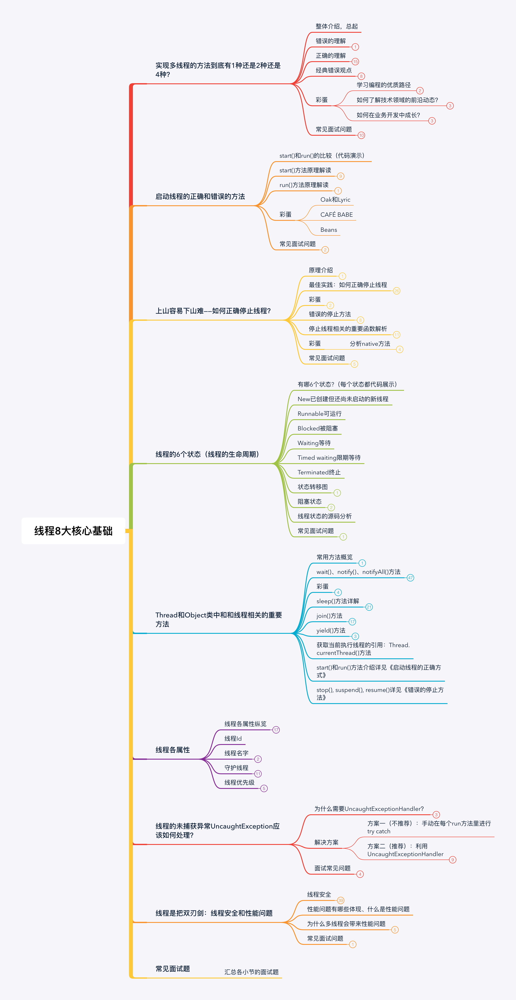

线程8大核心基础




# 线程的8大基础

## 实现多线程的方法到底有1种，还是2种？

答：两种

```java
/**
 *方法一 ： 实现Runnable接口
 * 描述： 用Runnable方式创建线程
 */
public class RunnableStyle implements Runnable{
    public static void main(String[] args) {
        Thread thread = new Thread(new RunnableStyle());
        thread.start();
    }

    @Override
    public void run() {
        System.out.println("用Runnable方法实现线程");
    }
}
```


```java

/**
 *方法二 ： 继承Thread类
 * 描述：  用Thread方式实现线程
 */
public class ThreadStyle extends Thread {

    public static void main(String[] args) {
        new ThreadStyle().start();
    }
    @Override
    public void run() {
        System.out.println("用Thread类实现线程");
    }
}
```

但是方法一比方法二要好，理由：

从代码架构，方法一是解耦的；

使用方法二，需要新建独立的线程，耗时耗资源，使用方法一，可以使用线程池

使用方法二，不可以再继承其他类，限制扩展性


Thread类和run方法的源码

```java
//new Thread源码
public Thread(Runnable target) {
    init(null, target, "Thread-" + nextThreadNum(), 0);
}

//run方法
@Override
    public void run() {
        if (target != null) {
            target.run();
        }
    }
```


两种方式同时运行

```java
/**
 * 同时有Runnable和Thread
 */
public class BothRunnableThread {
    public static void main(String[] args) {
        new Thread(new Runnable(){
            @Override
            public void run() {
                System.out.println("我来自Runnable");
            }
        }){
            @Override
            public void run() {
                System.out.println("我来自Thread");
            }
        }.start();
    }
}
//我来自Thread
//因为传入Runnable，但是run方法被重写了，所以执行new Thread()
```


**总结**

准确的说，创建线程只有一种方式，即构造Thread类，而实现线程的执行单元有两种方式：

- 方法一：实现Runnable接口的run方法，并把Runnable实例传给Thread类
- 方法二：重写Thread的run方法（继承Thread类)


**典型的错误观点**

- 线程池创建线程也算一种新建线程的方式
- 通过Callable和FutureTask创建线程，也算是一种新的创建线程的方式
- 无返回值是实现runnable接口，有返回值是实现callable接口，所以callable是新的实现线程的方式。
- 定时器
- 匿名内部类
- Lamda

```java
import java.util.concurrent.ExecutorService;
import java.util.concurrent.Executors;

/**
 * 描述 线程池创建线程的方法
 */
public class ThreadPool5 {
    public static void main(String[] args) {
        ExecutorService executorService = Executors.newCachedThreadPool();
        for (int i = 0; i < 1000; i++) {
            executorService.submit(new Task(){

            });
        }
    }
}
class Task implements Runnable{
    @Override
    public void run() {
        try {
            Thread.sleep(500);
        } catch (InterruptedException e) {
            e.printStackTrace();
        }
        //往线程里添加任务，打印线程名字
        System.out.println(Thread.currentThread().getName());
    }
}


/*
newCachedThreadPool本质也是new Thread
public Thread newThread(Runnable r) {
            Thread t = new Thread(group, r,
                                  namePrefix + threadNumber.getAndIncrement(),
                                  0);
            if (t.isDaemon())
                t.setDaemon(false);
            if (t.getPriority() != Thread.NORM_PRIORITY)
                t.setPriority(Thread.NORM_PRIORITY);
            return t;
        }
*/
```


## 怎样才是正确的线程启动方式？


## 如何正确停止线程？


## 线程的6个状态（生命周期）？


## Thread和Object类中的重要方法详解？


## 线程的各个属性？


## 未捕获异常如何处理？


## 双刃剑：多线程会导致的问题？


